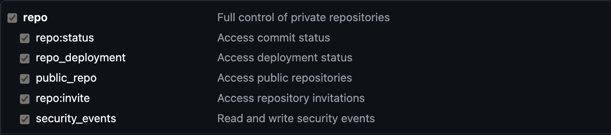
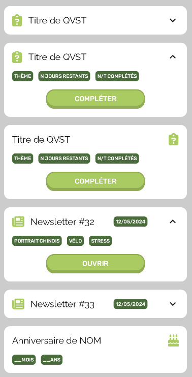
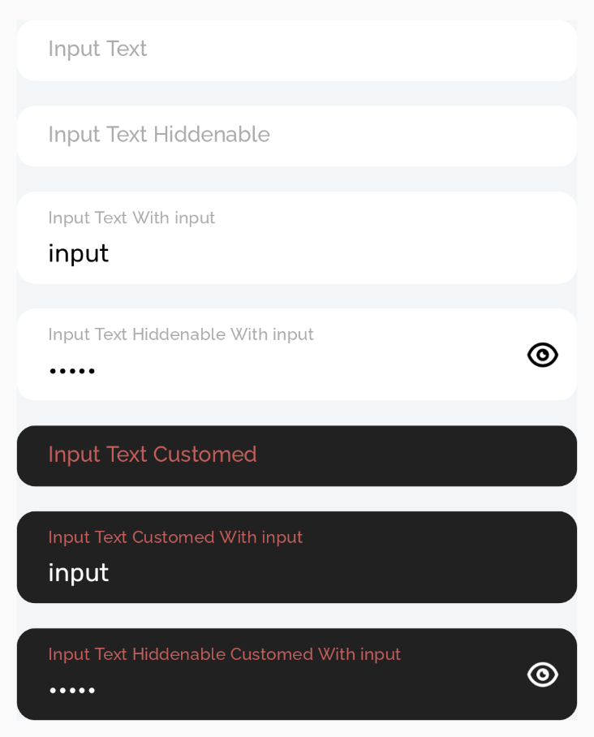
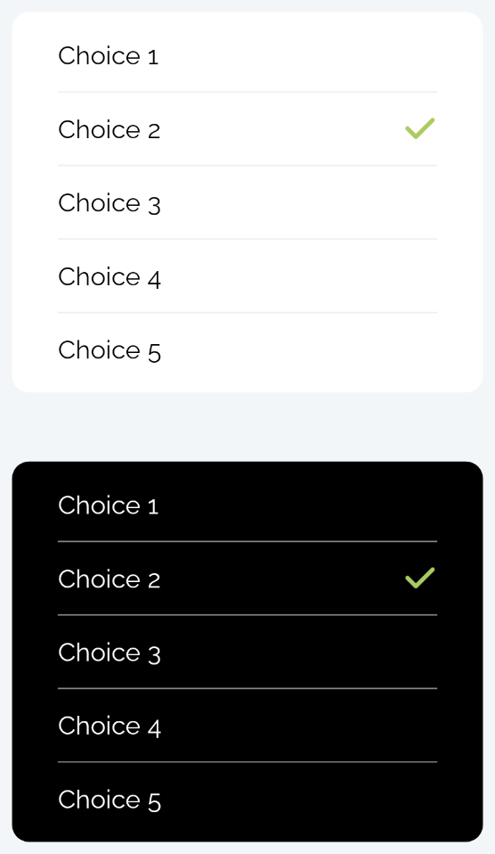
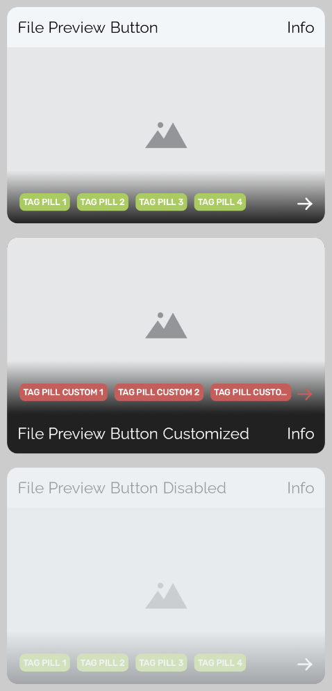

# xpeho_ui_android

This is an Android implementation of the Xpeho UI made with Jetpack Compose.

## Getting started

### Changes on the library

- Clone the repository using `git clone`
- Launch the folder in Android Studio
- Make your changes
- Send a Pull Request

### Import and use the library in your app

- Add the following code to your gradle repositories _(pluginManagement and dependencyREsolutionManagement blocks)_ :

  ```gradle
  maven {
      url 'https://maven.pkg.github.com/XPEHO/xpeho_ui_android'
      credentials {
          username = ""
          password = ""
      }
  }
  ```

- As you can see we don't set username and password, that's because we can't compute from a `github.properties` file in that type of block so we add the following code after these two blocks :

  ```gradle
  // Load properties from github.properties file
  def githubProperties = new Properties()
  file('github.properties').withInputStream { stream ->
      githubProperties.load(stream)
  }

  // Update credentials
  gradle.settingsEvaluated {
      pluginManagement.repositories {
          maven {
              url 'https://maven.pkg.github.com/XPEHO/xpeho_ui_android'
              credentials {
                  username = githubProperties['gpr.user'] ?: ""
                  password = githubProperties['gpr.key'] ?: ""
              }
          }
      }

      dependencyResolutionManagement.repositories {
          maven {
              url 'https://maven.pkg.github.com/XPEHO/xpeho_ui_android'
              credentials {
                  username = githubProperties['gpr.user'] ?: ""
                  password = githubProperties['gpr.key'] ?: ""
              }
          }
      }
  }
  ```

- For the creation of the `github.properties` refer to the linked section in the **Deployment** part.

- Now we can add in our **dependencies** block of the `build.gradle` file the following implementation :

  ```gradle
  //XpehoUI
  implementation "com.xpeho.packages:xpeho_ui_android:1.0.0"
  ```

- So the implementation is done you can now sync your gradle files and import the package in any file like this:

  ```java
  import com.xpeho.xpeho_ui_android.*
  ```

## Deployment

### Java Runtime

Make sure you have install a Java Runtime.

- MacOS : 
    ```shell
    brew install java
    echo 'export PATH="/usr/local/opt/openjdk/bin:$PATH"' >> ~/.zshrc
    export CPPFLAGS="-I/usr/local/opt/openjdk/include"
    ```

    After that you can relaunch your terminale or type :
    ```shell      
    source ~/.zshrc   
    ```

### Github properties

Define at the root of the repository a file `github.properties` following this structure :

```
gpr.user=YOUR_USERNAME
gpr.key=YOUR_PERSONAL_ACCESS_TOKEN
```

Make sure to generate a PAT (Personal Access Token) on your github account following the [documentation](https://docs.github.com/en/authentication/keeping-your-account-and-data-secure/managing-your-personal-access-tokens#creating-a-personal-access-token-classic).

You need to allow the following rights :



> [!WARNING]
> Make sure to have the right access to the repository to be able to deploy.

### Process

Make sure to update the version code in the [build.gradle.kts](xpeho_ui_android/build.gradle.kts) file, it will be the version code of the package on github.

Now launch a terminal in the root of the directory and type :

- `./gradlew assembleRelease`
- `./gradlew publish`

You can check the deployment by looking at the repository page, it should have your deployment on the packages section.

## Usage

### Assets

#### Icons

You can access icons of the library that are in the [drawable directory](xpeho_ui_android/src/main/res/drawable) using the following lines :

```kotlin
import com.xpeho.xpeho_ui_android.R.drawable as XpehoRes

XpehoRes.ICON_NAME
```

Make sure to replace ICON_NAME by the file name of the drawable you want to use.

#### Colors

Colors of the library :

- XPEHO_COLOR : 
- XPEHO_DARK_COLOR : 
- GREEN_DARK_COLOR : 
- RED_INFO_COLOR : 
- DISABLED_COLOR : 
- CONTENT_COLOR : 
- BACKGROUND_COLOR : 
- GRAY_LIGHT_COLOR : 

You can access them using the following lines :

```kotlin
import com.xpeho.xpeho_ui_android.foundation.Colors as XpehoColors

XpehoColors.COLOR_NAME
```

Make sure to replace COLOR_NAME by the name of the color you want to use.

#### Fonts

Fonts of the library :

- Rubik : rubik
- Roboto : roboto
- Raleway : raleway

You can access these fonts using the following lines:

```kotlin
import com.xpeho.xpeho_ui_android.foundation.Fonts as XpehoFonts

Text(
    "Text",
    fontFamily = XpehoFonts.FONT_NAME,
    fontWeight = FontWeight.FONT_WEIGHT
)
```

Make sure to replace FONT_NAME and FONT_WEIGHT by the name of the font and the weight you want to use.

### Available components

#### ClickyButton


Usage :

```kotlin
import com.xpeho.xpeho_ui_android.ClickyButton

ClickyButton(
    label = String,
    size = TextUnit,
    backgroundColor = Color,
    labelColor = Color,
    verticalPadding = Dp,
    horizontalPadding = Dp,
    enabled = Boolean,
    onPress = () -> Unit
)
```

#### TagPill


Usage:

```kotlin
import com.xpeho.xpeho_ui_android.TagPill

TagPill(
    label = String,
    size = TextUnit,
    backgroundColor = Color,
    labelColor = Color
)
```

#### CollapsableCard



Usage:

```kotlin
import com.xpeho.xpeho_ui_android.CollapsableCard

CollapsableCard(
    title = String,
    date = String,
    keywords = List<String>,
    onOpenPressed = () -> Unit,
    collapsed = Boolean
)
```

#### InputText



usage:

```kotlin
import com.xpeho.xpeho_ui_android.InputText

InputText(
    label = String,
    passwordSwitcherIcon = () -> Unit,
    defaultInput = String,
    labelSize = Float,
    inputSize = Float,
    labelColor = Color,
    backgroundColor = Color,
    inputColor = Color,
    password = Boolean,
    onInput = (String) -> Unit
)
```

#### ChoiceSelector



Usage:

```kotlin
import com.xpeho.xpeho_ui_android.ChoiceSelector

ChoiceSelector(
    label = String,
    choicesAvailable = List<String>,
    defaultSelectedChoice = String,
    size = Float,
    backgroundColor = Color,
    choiceColor = Color ,
    checkIconColor = Color,
    separatorColor = Color,
    onPress = (String) -> Unit
)
```

### FilePreviewButton



Usage:
```kotlin
import com.xpeho.xpeho_ui_android.FilePreviewButton

FilePreviewButton(
    labelStart: String,
    labelEnd: String,
    imagePreview: @Composable()-> Unit,
    tags: List<@Composable()-> Unit> = listOf({TagPill()},),
    height: Dp,
    labelSize: TextUnit,
    backgroundColor: Color,
    labelColor: Color,
    enabled: Boolean,
    labelPosition: LabelPosition,
    onPress: () -> Unit,
    arrowIcon: @Composable() -> Unit,
)


## Testing

### Snapshot testing

https://developer.android.com/studio/preview/compose-screenshot-testing?hl=fr
